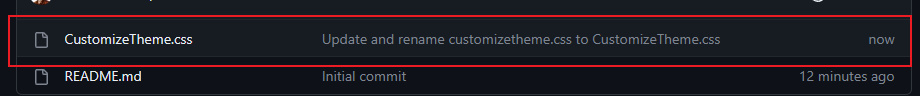
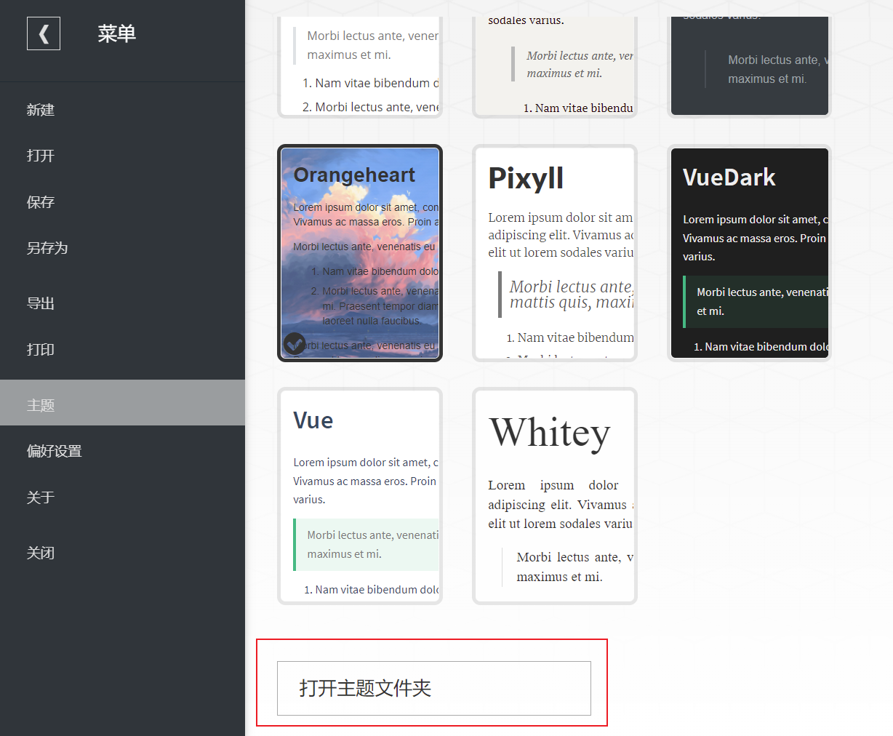

## 简介

这是一个基于原生主题[OrangeHeart]([evgo2017/typora-theme-orange-heart： A Typora Theme - 一个 Typora 主题 (github.com)](https://github.com/evgo2017/typora-theme-orange-heart))衍生制作出的客制化主题，沿用了此主题对于二级标题的渲染效果，从而拓展到三至六级标题。

如下是主要更改信息：

- 更改了代码块样式
- 更改了代码渲染样式，使之与VScode代码渲染样式更加相似
- 增加了背景图片(需要手动修改地址)
- 更改了侧边栏的样式
- 更改了原生有序列表格式
- 更改了目录渲染颜色和链接渲染颜色
- 添加了书写区域蒙版以减少视觉压力

## 快速开始

下载仓库内`CustomizeTheme.css`

在Typora中点击"主题"->"打开主题文件夹"

                                                   

将本css文件置入文件夹中

点开本文件，将下列划线部分改为所想要更改的图片路径，保存文件并重启Typora之后即可使用

